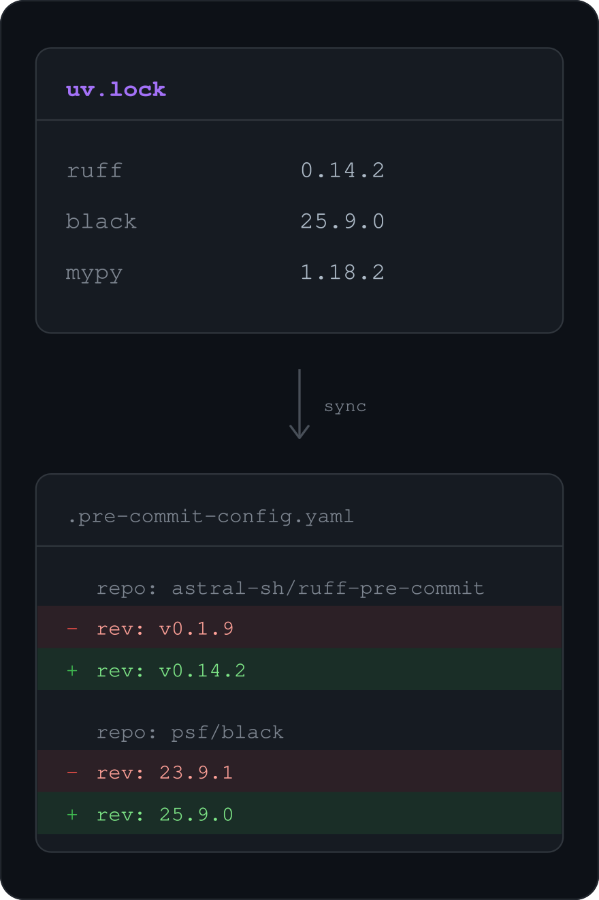

# sync-with-uv

**Pin pre-commit hooks to the versions already resolved in your `uv.lock`.**
One source of truth for black, ruff, mypy, and the rest.

<p align="center">
  
</p>

<p align="center">

[![Tests][tests-badge]][tests-link]
[![codecov][codecov-badge]][codecov-link]
[![PyPI version][pypi-version-badge]][pypi-link]
[![Total downloads][pepy-badge]][pepy-link]
[![Made Using tsvikas/python-template][template-badge]][template-link]
[![GitHub Discussion][github-discussions-badge]][github-discussions-link]

</p>

## Overview

[PEP 735](https://peps.python.org/pep-0735/) introduces dependency groups in `pyproject.toml`,
allowing tools like black, ruff, and mypy to be managed centrally.
However, when these tools are also used in pre-commit hooks,
keeping versions in sync between `uv.lock` and `.pre-commit-config.yaml`/`prek.toml` can be tedious.

This package automatically updates the versions of dependencies in `.pre-commit-config.yaml`/`prek.toml` to match their versions in `uv.lock`,
ensuring everything stays aligned and is managed from a single source.
Any tool not specified in `uv.lock` remains managed by `.pre-commit-config.yaml`/`prek.toml`.

Simply add this pre-commit hook to your setup and enjoy consistent dependency management.

## Usage

### Recommended: Use as a pre-commit hook

Simply add these lines to your `.pre-commit-config.yaml` file:

```yaml
- repo: https://github.com/tsvikas/sync-with-uv
  rev: main  # replace with the latest version
  hooks:
    - id: sync-with-uv
```

or to your `prek.toml`:

```toml
[[repos]]
repo = "https://github.com/tsvikas/sync-with-uv"
rev = "main"  # replace with the latest version
hooks = [{ id = "sync-with-uv" }]
```

> [!NOTE]
> Place this hook **after** hooks that modify `uv.lock` (like `uv-lock`), and **before** hooks that read versions from `.pre-commit-config.yaml`/`prek.toml` (like `sync-pre-commit-deps`).

That's it! The hook syncs versions for any tool present in **both** your pre-commit config and `uv.lock`.
To make a tool eligible, add it to your uv dependencies with `uv add --group dev <tool-name>`.

### Alternative: Command Line Interface

For manual usage or CI/CD integration, install and run directly:

```bash
uv tool install sync-with-uv

# Update .pre-commit-config.yaml / prek.toml
sync-with-uv

# Preview changes only
sync-with-uv --diff

# Custom file paths
sync-with-uv -u custom-lock.toml
sync-with-uv -p custom-precommit.yaml
sync-with-uv -p custom-prek.toml
```

## Syncing additional dependencies

Besides the `rev` of each hook, the tool can also sync version pins inside
`additional_dependencies` (or any other dependency line).
Because these lists can contain arbitrary packages,
syncing is strictly opt-in per line:
a dependency is only touched if its line carries a `# sync-with-uv` pragma comment.

```yaml
- repo: https://github.com/adamchainz/blacken-docs
  rev: 1.16.0
  hooks:
    - id: blacken-docs
      additional_dependencies:
        - black==23.9.1  # sync-with-uv
        - some-other-lib==1.0.0  # left alone, no pragma
```

For every annotated line, the dependency is pinned to an exact version
(`==`) from `uv.lock`, adding a specifier when the dependency has none,
so the example above becomes `black==<locked>`.
The package name, extras (like `black[jupyter]`), environment markers
(like `; python_version < "3.11"`), quoting, and the comment itself are preserved.

Because the pragma is an explicit request to sync a line,
the tool errors (exit code 123) when an annotated line cannot be synced.

## Advanced Configuration

The tool works out of the box with popular tools like black, ruff, and mypy,
as well as commonly used mirrors for those tools.
Most users don't need the settings below.

### Mapping from repo URL to package name

<details>
<summary>Details and example</summary>

By default, the tool assumes the last part of a repo URL is the package name.
For example, if `repo: https://github.com/my-org/my-awesome-linter` is in `.pre-commit-config.yaml`/`prek.toml`,
the tool will sync with the version of `my-awesome-linter` in `uv.lock`.

The tool skips any repo without a corresponding package in `uv.lock`.

To link a repo to a different package name,
add an entry to the `[tool.sync-with-uv.repo-to-package]` section in `pyproject.toml`.

Use an empty value to disable syncing for a specific repo.

```toml
[tool.sync-with-uv.repo-to-package]
# sync this repo with the `awesome-linter` package
"https://github.com/my-org/my-awesome-linter" = "awesome-linter"
# do not sync this repo, even if `cool-tool` is in `uv.lock`
"https://github.com/my-org/cool-tool" = ""
```

</details>

### Mapping from repo URL to version tag format

<details>
<summary>Details and example</summary>

For each repo in `.pre-commit-config.yaml`/`prek.toml` with a linked package,
the tool updates the `rev` field with the version from `uv.lock`, optionally preserving a leading `v`.
The tool preserves the original formatting and any comments on the `rev` line.
For example, if the `uv.lock` version is `1.2.3`,
it will update `rev: 1.0.0` to `rev: 1.2.3`,
and `rev: v1.0.0` to `rev: v1.2.3`.

To use a custom format for the `rev` field,
add an entry to the `[tool.sync-with-uv.repo-to-version-template]` section in `pyproject.toml`,
using `${version}` as a placeholder for the package version.

```toml
[tool.sync-with-uv.repo-to-version-template]
# for example, this project uses `version_1.2.3` format for tags
"https://github.com/my-org/my-awesome-linter" = "version_${version}"
```

</details>

## Contributing

Interested in contributing?
See [CONTRIBUTING.md](CONTRIBUTING.md) for development setup and guideline.

[codecov-badge]: https://codecov.io/gh/tsvikas/sync-with-uv/graph/badge.svg
[codecov-link]: https://codecov.io/gh/tsvikas/sync-with-uv
[github-discussions-badge]: https://img.shields.io/static/v1?label=Discussions&message=Ask&color=blue&logo=github
[github-discussions-link]: https://github.com/tsvikas/sync-with-uv/discussions
[pepy-badge]: https://img.shields.io/pepy/dt/sync-with-uv
[pepy-link]: https://pepy.tech/project/sync-with-uv
[pypi-link]: https://pypi.org/project/sync-with-uv/
[pypi-version-badge]: https://img.shields.io/pypi/v/sync-with-uv
[template-badge]: https://img.shields.io/badge/%F0%9F%9A%80_Made_Using-tsvikas%2Fpython--template-gold
[template-link]: https://github.com/tsvikas/python-template
[tests-badge]: https://github.com/tsvikas/sync-with-uv/actions/workflows/ci.yml/badge.svg
[tests-link]: https://github.com/tsvikas/sync-with-uv/actions/workflows/ci.yml
